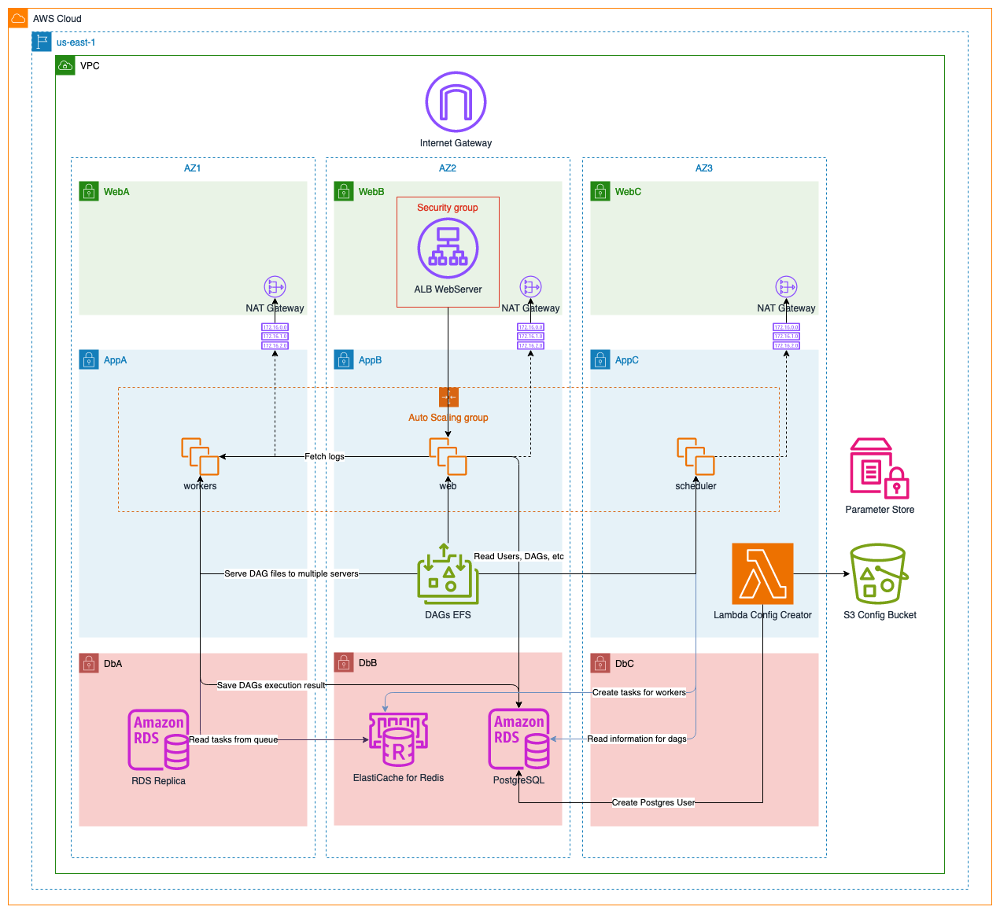

# AIRFLOW ON AWS

These cloudformation template is created to deploy Airflow on AWS with managed services.

## Resources:

In cloudformation folder you will found 4 templates, the following files are:

- cf-configbucket.yaml : Deploy S3 Bucket with encryption and versioning enabled, used to store airflow configuration.

## Templates:

### 1-cf-base.yaml:

Template used to deploy base network stack.

Resources:
- VPC
- Subnets
- Route Tables
- InternetGateway

**CONFIGURATION**
Stack Name: kodelab-network-stack

**OUTPUTS**
Output are created with the name of stack to be unique in aws region.
|Output Name|Description|Value|
|-|-|-|
|VPCId|VPC ID|\${AWS::StackName}-VPCID|
|SubnetWebA|WebA Subnet ID|${AWS::StackName}-SubnetWebA|
|SubnetWebB|WebB Subnet ID|${AWS::StackName}-SubnetWebB|
|SubnetWebC|WebC Subnet ID|${AWS::StackName}-SubnetWebC|
|SubnetAppA|AppA Subnet ID|${AWS::StackName}-SubnetAppA|
|SubnetAppB|AppB Subnet ID|${AWS::StackName}-SubnetAppB|
|SubnetAppC|AppC Subnet ID|${AWS::StackName}-SubnetAppC|
|SubnetDbA|DbA Subnet ID|${AWS::StackName}-SubnetDbA|
|SubnetDbB|DbB Subnet ID|${AWS::StackName}-SubnetDbB|
|SubnetDbC|DbC Subnet ID|${AWS::StackName}-SubnetDbC|

### 2-cf-image-builder-airflow.yaml

Template used to create ec2 image builder pipeline to create custom AMI for airflow based on Ubuntu 22.04.

Resources:
- ImagePipeline
- Distribution Configuration
- Infraestructure Configuration
- Component

**PARAMETERS:**
|Parameter Name|Description|Default Value|Type|
|-|-|-|-|
|UbuntuLatestAmi|SSM Parameter to be with the latest Ubuntu AMI ID|/aws/service/canonical/ubuntu/server/22.04/stable/current/amd64/hvm/ebs-gp2/ami-id|AWS::SSM::Parameter::Value<String>|

### 3-cf-configbucket.yaml

Template used to create s3 bucket to store airflow configuration files.
This bucket is configured with versioning enabled and SSE-S3 for encryption.

The following files must exists in the bucket:
- config-templates/airflow.cfg
- helpers/ec2-health-check.sh
- services/airflow-web.service
- services/airflow-scheduler.service
- services/airflow-worker.service
- services/health-checker.service

**OUTPUTS**
Outputs are create with name of stack to be unique in aws region.
|Output Name|Description|Value|
|-|-|-|
|S3Bucket|S3 Bucket Name|${AWS::StackName}-S3ConfigBucketName|
|S3BucketArn|S3 Bucket ARN|${AWS::StackName}-S3ConfigBucketBucketArn|

### 4-cf-airflow.yaml

Template used to deploy airflow on an aws vpc, this template deploys the following resources.

- Application Load Balancer
- AutoScaling Group Web Servers
- AutoScaling Group Scheduler
- AutoScaling Group Workers
- RDS - Postgres
- ElastiCache - Redis
- EFS - Standard
- AWS Lambda on VPC

**PARAMETERS:**
|Parameter Name|Description|Default Value|Type|
|-|-|-|-|
|NetworkStackName|Cloudformation Stack, this stack should export VPC and Subnets IDs|kodelab-network-stack|String|
|S3ConfigStackName|Cloudformation Stack, this stack should export S3 Bucket Name and ARN|airflow-config-bucket|String|
|EnvType|Type of enviroment to be deployed. AllowedValues: `prod, dev`|dev|String|
|AirflowAmi|AMI ID of Airflow based on Ubuntu AMI|-|AWS::EC2::Image::Id|
|WebServerInstanceSize|Instance size of webservers launch template|t2.micro|String|
|ServersKeyName|Key Pair used to connect to servers.|-|AWS::EC2::KeyPair::KeyName|
|RedisCacheSize|Node type from elasticache cache cluster|cache.t2.micro|String|
|RedisPassword|Name of the SSM parameter referencing redis password.|/airflow/redis/dbpasswordairflow|String|
|RDSInstanceClass|Instance class of RDS DB Instance|String|db.t4g.micro|
|RDSInstanceStorage|Postgres RDS storage|20|String|
|RDSInstanceVersion|Postgres RDS version|15.3|String|
|RDSInstanceBackupPeriod|Postgres RDS backup time retention. For dev is recomended 0 to disable.|15|Number|
|RDSMasterUser|Name of the SSM parameter referencing master user|/airflow/postgres/masteruser|AWS::SSM::Parameter::Value<String>|
|RDSMasterPassword|Name of the SSM parameter referencing rds master password.|/airflow/postgres/masterpassword|String|
|RDSAirflowUser|Name of the SSM parameter referencing rds airflow user.|/airflow/postgres/userairflow|AWS::SSM::Parameter::Value<String>|
|RDSAirflowPassword|Name of the SSM parameter referencing rds airflow password.|/airflow/postgres/passwordairflow|String|
|RDSDbName|Name of RDS default database|airflow_db|String|
|AirflowFernetKey|Parameter containing fernet key to be used in airflow.cfg|/airflow/config/fernetkey|String|
|AirflowSecretKey|Parameter containing secret key to be used in airflow.cfg|/airflow/config/secretkey|String|
|AirflowConfigVersionId|Version ID of the "airflow.cfg" template s3 bucket.|-|String|
|AirflowImageHelperDbUri|ECR Image URI of dbhelper in s3 bucket.|-|String|
